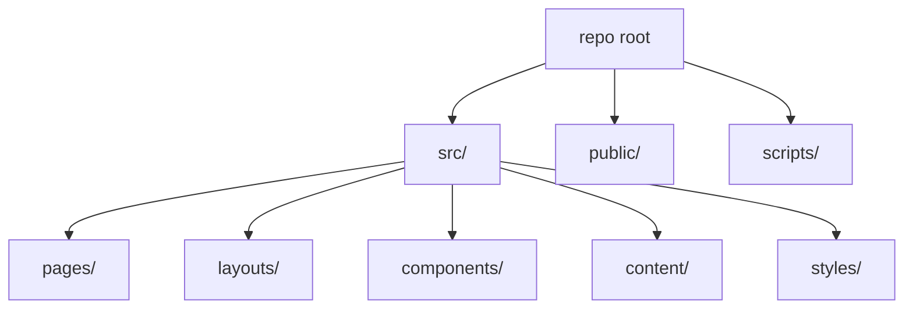

# Structure projet & conventions

Meta
Version : v1.0
Last updated : 2026-01-19
Perimetre : organisation des dossiers, routing Astro, conventions de nommage et contenu.
Audience : dev / content / SEO
Liens : ./1-architecture-technique-stack.md, ./3-workflow-publication-automatisation.md, ./4-seo-geo-ciblage-strategie.md, ./5-optimisation-images-performances.md, ./9-workflows-checklists-operationnels.md

## Vue d'ensemble
Le repo suit l'arborescence Astro standard : `src/pages` pour les routes, `src/layouts` pour les layouts, `src/components` pour les composants, `src/content` pour le contenu MD. Les assets publics sont dans `public/`.



## Existant dans ce repo (as-is)
### Arborescence rapide (extraits)
```
/
  astro.config.mjs
  package.json
  netlify.toml
  public/
    images/
    fonts/
    _headers
    _redirects
  scripts/
    convert-to-webp.js
  src/
    pages/
      index.astro
      blog/[slug].astro
      cours/[slug].astro
      cours/programme/[slug].astro
      ressources/[slug].astro
      sitemap.xml.ts
    layouts/
      Layout.astro
      ArticleLayout.astro
      CourseLayout.astro
      ProgrammeLayout.astro
    components/
      OptimizedImage.astro
      EmailCaptureForm.astro
      RelatedArticles.astro
      ...
    content/
      blog/*.md
      courses/*.md
      programmes/*.md
      ressources/*.md
      livres/*.md
    styles/
      global.css
      article.css
      components.css
      design-tokens.css
```

### Routing Astro (sources)
- Pages statiques: `src/pages/*.astro`
- Routes dynamiques: `src/pages/blog/[slug].astro`, `src/pages/cours/[slug].astro`, `src/pages/cours/programme/[slug].astro`, `src/pages/ressources/[slug].astro`, `src/pages/livres/[slug].astro`
- Endpoint XML: `src/pages/sitemap.xml.ts`

### Contenu Markdown
- Articles: `src/content/blog/*.md`
- Cours: `src/content/courses/*.md`
- Programmes: `src/content/programmes/*.md`
- Ressources: `src/content/ressources/*.md`
- Livres: `src/content/livres/*.md`
- Legal: `src/content/legal/*.md`

### Fichiers de reference
- `src/pages/`
- `src/layouts/`
- `src/components/`
- `src/content/`
- `src/styles/`
- `src/content/config.ts`
- `astro.config.mjs`

## Comment ca marche
- Le routing est automatique: le chemin de fichier dans `src/pages` devient une route.
- Les collections de contenu sont chargees via `getCollection('...')`.
- Les layouts centralisent les meta tags, JSON-LD, et le head global.

### Exemple frontmatter (blog)
```md
---
title: "Apprendre la guitare facilement - Guide complet"
description: "Le guide ultime..."
author: "Fred Fieffe"
ogImage: "/images/blog/apprendre-la-guitare-facilement-guide-complet-pour-debutants.webp"
datePublished: "2026-04-07"
dateModified: "2025-04-07"
prod: "Y"
---
```
Source: `src/content/blog/apprendre-la-guitare-facilement-guide-complet-pour-debutants.md`

### Exemple frontmatter (cours)
```md
---
affichage: "Y"
classement: 1
title: "Cours de Guitare pour Debutants en Ligne"
ogImage: "https://musique-facile.fr/images/cours/apprendre-guitare-debutant/hero.jpg"
theme: "guitar"
datePublished: "2025-01-30"
hero:
  badge: "Pour debutants"
  title: "Apprenez la guitare pas a pas"
---
```
Source: `src/content/courses/apprendre-guitare-debutant.md`

## Ou toucher dans le code
- Nouvelles pages: `src/pages/` (Astro)
- Nouveaux articles: `src/content/blog/`
- Nouveaux cours: `src/content/courses/`
- Styles globaux: `src/styles/global.css`, `src/styles/design-tokens.css`
- Layouts SEO: `src/layouts/*.astro`

## Conventions & regles a respecter
- Nommage des routes: kebab-case, aligner slug et nom de fichier Markdown.
- Conserver les champs frontmatter declares dans `src/content/config.ts`.
- Garder `ogImage` en URL absolue ou chemin `public/`.
- Garder les images de cours sous `public/images/cours/<slug>/` (voir `src/pages/cours/[slug].astro`).

## Antipatterns / pieges
- Ajouter un dossier de contenu sans schema declare (ex: `ressources`, `programmes`) sans verifier `src/content/config.ts`.
- Utiliser des slugs differents entre fichier Markdown et route attendue.
- Placer des images hors `public/` si elles sont referencees par URL relative dans Markdown.

## Checklist de validation
- Nouveau contenu apparait dans `astro dev`.
- `getStaticPaths` genere bien les slugs.
- Les images locales sont resolues et ont width/height.
- Canonical et OG image corrects.

## TODO / Recommandations
- Harmoniser les schemas de collections entre `astro.config.mjs` et `src/content/config.ts`.
- Ajouter une convention ecrite pour la gestion des slugs et themes.

## Voir aussi
- ./1-architecture-technique-stack.md
- ./3-workflow-publication-automatisation.md
- ./4-seo-geo-ciblage-strategie.md
- ./5-optimisation-images-performances.md
- ./9-workflows-checklists-operationnels.md
