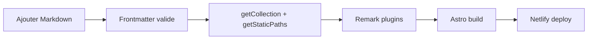

# Workflow publication & automatisation

Meta
Version : v1.0
Last updated : 2026-01-19
Perimetre : creation de contenu, publication, scripts automatises, pipeline remark.
Audience : content / dev / SEO
Liens : ./1-architecture-technique-stack.md, ./2-structure-projet-conventions.md, ./4-seo-geo-ciblage-strategie.md, ./5-optimisation-images-performances.md, ./9-workflows-checklists-operationnels.md

## Vue d'ensemble
Les articles et contenus sont publies via `src/content/*` et rendus par des pages dynamiques dans `src/pages`. Le build filtre les articles selon `prod` et la date de publication. Les scripts internes gerent la conversion des images et la generation de sitemap.



## Existant dans ce repo (as-is)
- Publication blog: `src/pages/blog/[slug].astro` utilise `getCollection('blog')` et filtre `prod === 'N'` + date future.
- Collection schema: `src/content/config.ts` (blog/courses/livres).
- Plugins remark actives: `src/remark-custom-blocks.mjs`, `src/remark-optimize-images.mjs`, `src/remark-lazy-images.mjs`.
- Scripts: `scripts/convert-to-webp.js`, `src/scripts/generate-sitemap.ts`.

### Fichiers de reference
- `src/pages/blog/[slug].astro`
- `src/content/config.ts`
- `src/remark-custom-blocks.mjs`
- `src/remark-optimize-images.mjs`
- `src/remark-lazy-images.mjs`
- `scripts/convert-to-webp.js`
- `src/scripts/generate-sitemap.ts`

## Comment ca marche
### Creation d'un article
1) Creer un fichier `.md` dans `src/content/blog/`.
2) Remplir le frontmatter avec les champs requis (voir schema `blog`).
3) Mettre `prod: "Y"` et une `datePublished` <= date courante pour generer la page.
4) Ajouter des images sous `public/images/...` pour que `remark-optimize-images` puisse lire les dimensions.

### Exemple frontmatter (blog)
```md
---
title: "Apprendre la guitare facilement"
description: "Le guide ultime..."
author: "Fred Fieffe"
ogImage: "/images/blog/apprendre-la-guitare-facilement-guide-complet-pour-debutants.webp"
datePublished: "2026-04-07"
dateModified: "2025-04-07"
prod: "Y"
multi: "N"
prev: "..." # optionnel
next: "..." # optionnel
---
```
Source: `src/content/blog/apprendre-la-guitare-facilement-guide-complet-pour-debutants.md`

### Blocs custom (remark-custom-blocks)
```md
::: tip {title="Astuce"}
Texte du bloc.
:::
```
Source plugin: `src/remark-custom-blocks.mjs`

### Automatisations existantes
| Script | Usage | Effet |
| --- | --- | --- |
| `npm run optimize-images` | Conversion manuelle | Genere des `.webp` dans `public/images` |
| `npm run generate-sitemap` | Build step optionnel | Ecrit `public/sitemap.xml` |

## Ou toucher dans le code
- Contenu blog: `src/content/blog/`
- Contenu cours/programmes/ressources/livres: `src/content/**`
- Templates pages: `src/pages/blog/[slug].astro`, `src/pages/cours/[slug].astro`
- Plugins remark: `src/remark-*.mjs`

## Conventions & regles a respecter
- `prod: "N"` desactive la generation de page (blog).
- `datePublished` dans le futur => page non generee (blog).
- Les images locales doivent etre sous `public/` pour la resolution des dimensions.
- Les champs `prev`/`next` ne doivent etre utilises que si `multi: "Y"`.

## Antipatterns / pieges
- Publier un article sans `ogImage` ou sans `dateModified`.
- Mettre des URLs d'images locales sans les copier dans `public/`.
- Oublier que `prod` est une string (`"Y"` / `"N"`) et non un boolean.

## Checklist de validation
- `astro dev` affiche l'article.
- `prod` = `Y` et date <= aujourd'hui.
- Les images ont width/height en HTML (via remark).
- Schema JSON-LD present sur la page.

## TODO / Recommandations
- Declarer les collections `ressources` et `programmes` dans `src/content/config.ts` si necessaire.
- Documenter le flux de publication Netlify (build command / publish dir) dans la doc ops.

## Voir aussi
- ./1-architecture-technique-stack.md
- ./2-structure-projet-conventions.md
- ./4-seo-geo-ciblage-strategie.md
- ./5-optimisation-images-performances.md
- ./9-workflows-checklists-operationnels.md
