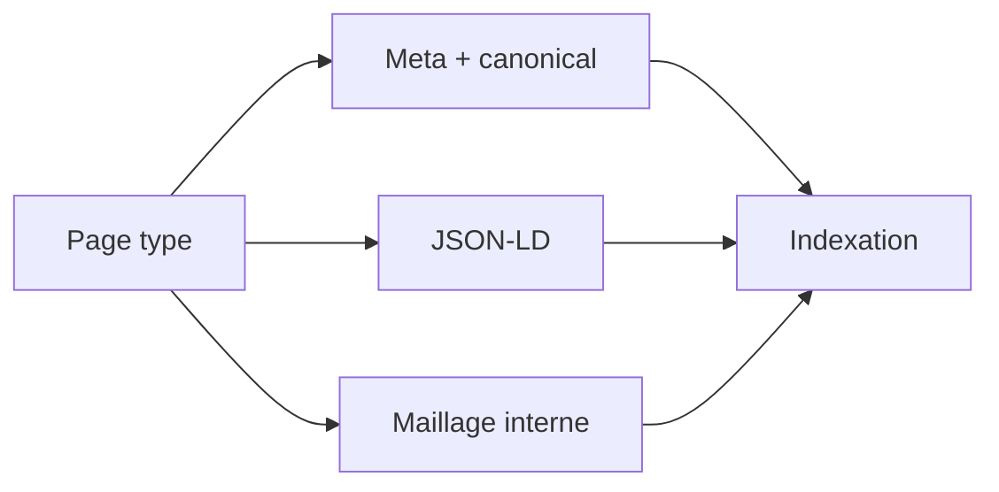

# SEO & geo-ciblage (strategie + existant)

Meta
Version : v1.0
Last updated : 2026-01-19
Perimetre : SEO existant, ciblage geo, types de pages, maillage interne, mesure.
Audience : SEO / content / dev
Liens : ./1-architecture-technique-stack.md, ./2-structure-projet-conventions.md, ./3-workflow-publication-automatisation.md, ./8-seo-technique-structured-data.md, ./9-workflows-checklists-operationnels.md

## Vue d'ensemble
Le SEO est largement gere via les layouts (meta, canonical, OG) et un ensemble riche de schemas JSON-LD. Le site dispose d'un sitemap dynamique et d'un robots.txt dans `public/`. Le geo-ciblage n'est pas explicitement implemente (pas de pages locales ni hreflang).

## Existant dans ce repo (as-is)
### SEO technique en place
- Meta + canonical + OG/Twitter dans `src/layouts/Layout.astro`, `src/layouts/ArticleLayout.astro`, `src/layouts/CourseLayout.astro`.
- Robots.txt publie: `public/robots.txt` (inclut sitemap).
- Sitemap dynamique: `src/pages/sitemap.xml.ts`.
- Sitemap statique genere: `public/sitemap.xml` (script `src/scripts/generate-sitemap.ts`).
- JSON-LD multiplie: Course, BlogPosting, FAQ, BreadcrumbList, Organization, WebSite, Product, Book, Review, HowTo, VideoObject.

### Maillage interne existant
- Breadcrumbs schema: `src/components/BreadcrumbsSchema.astro`, `src/components/Breadcrumbs.astro`.
- Articles connexes: `src/components/RelatedArticles.astro`.
- Navigation prev/next sur articles multi-page: `src/pages/blog/[slug].astro`.

### Tracking / analytics
- GTM present (ID `GTM-NP758HSC`) dans layouts. `src/layouts/*.astro`
- Event gtag dans `src/components/EmailCaptureForm.astro` (depend d'une config GTM).

### Fichiers de reference
- `src/layouts/Layout.astro`
- `src/layouts/ArticleLayout.astro`
- `src/layouts/CourseLayout.astro`
- `public/robots.txt`
- `src/pages/sitemap.xml.ts`
- `public/sitemap.xml`
- `src/components/RelatedArticles.astro`

## Comment ca marche
- Chaque page construit un canonical (souvent via `Astro.url` ou base URL).
- Les schemas JSON-LD sont injectes via `<script type="application/ld+json">`.
- Le sitemap dynamique agregre `getCollection('blog'/'courses'/'programmes'/'ressources'/'livres')`.

### Mapping pages -> objectif SEO
| Type de page | Exemple | Objectif |
| --- | --- | --- |
| Blog | `src/pages/blog/[slug].astro` | Acquisition longue traine |
| Cours | `src/pages/cours/[slug].astro` | Conversion formation |
| Programmes | `src/pages/cours/programme/[slug].astro` | Nurture / detail |
| Ressources | `src/pages/ressources/[slug].astro` | Lead magnet |
| Landing offre | `src/pages/offre.astro` | Conversion pack |
| Livres | `src/pages/livres/[slug].astro` | Monitisation secondaire |

## Ou toucher dans le code
- Meta/OG/canonical: `src/layouts/*.astro` + pages specifiques `src/pages/*.astro`
- JSON-LD: layouts + pages `src/pages/*` et composants (FAQ/Breadcrumbs)
- Sitemap/robots: `src/pages/sitemap.xml.ts`, `public/robots.txt`
- Maillage interne: `src/components/RelatedArticles.astro`, `src/components/Breadcrumbs*.astro`

## Conventions & regles a respecter
- Mettre `ogImage` pour chaque page content.
- Maintenir `datePublished`/`dateModified` coherents (JSON-LD + sitemap).
- Garder les slugs stables pour SEO (redirects si changement).

## Antipatterns / pieges
- Avoir deux sources de sitemap (statique + dynamique) sans clarifier la priorite.
- Ajouter des pages locales sans canonical ou schema.
- Inserer des liens internes non lies a `public/_redirects` quand un slug change.

## Checklist de validation
- Canonical present et valide sur pages majeures.
- JSON-LD valide (Rich Results Test).
- Sitemap accessible et a jour.
- Robots.txt reference bien le sitemap publie.

## TODO / Recommandations
- Definir une strategie geo (pages locales / villes) si besoin.
- Documenter le standard de pages localisees (slug, meta, schema LocalBusiness si applicable).
- Clarifier la source de verite pour sitemap (route Astro vs fichier statique).

## Voir aussi
- ./1-architecture-technique-stack.md
- ./2-structure-projet-conventions.md
- ./3-workflow-publication-automatisation.md
- ./8-seo-technique-structured-data.md
- ./9-workflows-checklists-operationnels.md
