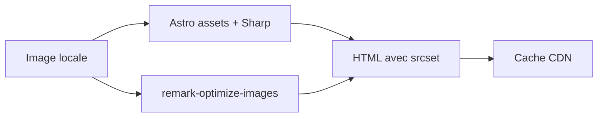

# Optimisation images & performances

Meta
Version : v1.0
Last updated : 2026-01-19
Perimetre : pipeline images, perf web, caching, outils existants.
Audience : dev / SEO / ops
Liens : ./1-architecture-technique-stack.md, ./2-structure-projet-conventions.md, ./3-workflow-publication-automatisation.md, ./7-maintenance-monitoring-runbook.md, ./8-seo-technique-structured-data.md

## Vue d'ensemble
Le repo combine l'optimisation d'images via Astro (Sharp), un composant d'image optimise et des plugins remark qui ajoutent des attributs perf. Le caching est defini via Netlify et `public/_headers`.

## Existant dans ce repo (as-is)
### Pipeline images
- Astro image service (Sharp) + formats `webp`, `avif`: `astro.config.mjs`
- Composant image optimise: `src/components/OptimizedImage.astro`
- Plugin remark: `src/remark-optimize-images.mjs` (width/height + alt text)
- Lazy loading: `src/remark-lazy-images.mjs` (first image eager, autres lazy)
- Conversion WebP batch: `scripts/convert-to-webp.js`

### Perf globale
- Fonts preload: `src/layouts/Layout.astro`
- Scripts externes defer + preconnect: `src/components/ExternalResources.astro`
- Minification Terser: `astro.config.mjs`
- Caching Netlify: `netlify.toml`, `public/_headers`

### Fichiers de reference
- `astro.config.mjs`
- `src/components/OptimizedImage.astro`
- `src/remark-optimize-images.mjs`
- `src/remark-lazy-images.mjs`
- `scripts/convert-to-webp.js`
- `public/_headers`
- `netlify.toml`

## Comment ca marche
### Images locales (Astro assets)
- Utiliser `OptimizedImage` pour generer `srcset`, `webp`, lazy loading et ratio fixe.
- Les images Markdown passent par `remark-optimize-images` qui ajoute width/height si l'image est locale.

### Script conversion WebP
- Cible: `public/images/**/*.{jpg,jpeg,png}`
- Sortie: meme chemin en `.webp`
- Mode: manuel via `npm run optimize-images`

### Table des mecanismes perf
| Mecanisme | Ou | Effet |
| --- | --- | --- |
| Astro assets (Sharp) | `astro.config.mjs` | WebP/AVIF + resize |
| `OptimizedImage` | `src/components/OptimizedImage.astro` | CLS reduit, lazy |
| `remark-optimize-images` | `src/remark-optimize-images.mjs` | width/height + alt |
| `remark-lazy-images` | `src/remark-lazy-images.mjs` | eager/lazy + fetchpriority |
| Cache headers | `public/_headers`, `netlify.toml` | Long cache assets |

## Ou toucher dans le code
- Composant images: `src/components/OptimizedImage.astro`
- Plugins Markdown: `src/remark-*.mjs`
- Styles images: `src/styles/article.css`
- Assets: `public/images/`, `public/fonts/`

## Conventions & regles a respecter
- Mettre les images locales dans `public/` si elles sont referencees par Markdown.
- Utiliser `OptimizedImage` pour les assets visibles dans les pages.
- Prevoir width/height pour eviter CLS.
- Prefetch / preconnect uniquement pour domaines necessaires.

## Antipatterns / pieges
- Inserer des images externes sans fallback size (pas de width/height).
- Dupliquer les regles de cache entre `netlify.toml` et `public/_headers` sans coherences.
- Oublier que `remark-optimize-images` ne traite pas les URLs externes.

## Checklist de validation
- Pages critiques LCP: hero image en eager.
- CLS proche de 0 (width/height present).
- Assets caches (Cache-Control) ok.
- Lighthouse perf > 90 sur pages principales.

## TODO / Recommandations
- Documenter un guide de tailles d'images par type de page.
- Clarifier la priorite des headers de cache (Netlify vs `public/_headers`).

## Voir aussi
- ./1-architecture-technique-stack.md
- ./2-structure-projet-conventions.md
- ./3-workflow-publication-automatisation.md
- ./7-maintenance-monitoring-runbook.md
- ./8-seo-technique-structured-data.md
