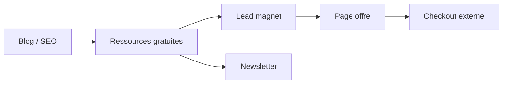

# Conversion & engagement funnel

Meta
Version : v1.0
Last updated : 2026-01-19
Perimetre : parcours utilisateur, CTA, lead magnets, capture email, tracking.
Audience : marketing / SEO / dev
Liens : ./2-structure-projet-conventions.md, ./3-workflow-publication-automatisation.md, ./4-seo-geo-ciblage-strategie.md, ./5-optimisation-images-performances.md, ./9-workflows-checklists-operationnels.md

## Vue d'ensemble
Le funnel repose sur du contenu organique (blog), des pages de ressources gratuites, des pages de lead magnet, puis des pages d'offre. La capture email est implantee via un formulaire custom et un embed ActiveCampaign.

## Existant dans ce repo (as-is)
### Entonnoir reel (preuves)
- Contenu acquisition: `src/pages/blog/[slug].astro` + `src/content/blog/*.md`.
- Ressources gratuites: `src/pages/ressources-gratuites/*.astro` + `src/pages/ressources/[slug].astro`.
- Lead magnet: `src/pages/5-accords-magiques.astro`, page merci `src/pages/merci-lead-magnet.astro` (robots noindex).
- Pages offres: `src/pages/offre.astro`, `src/pages/pack-vacances-ukulele.astro`, `src/pages/stage2025.astro`.
- Capture email: `src/components/EmailCaptureForm.astro` + embed ActiveCampaign dans footer.

| Etape | Page / composant | Intent |
| --- | --- | --- |
| Acquisition | `src/pages/blog/[slug].astro` | SEO / trafic organique |
| Lead | `src/pages/ressources/[slug].astro` | Capture email |
| Magnet | `src/pages/5-accords-magiques.astro` | Conversion lead |
| Offre | `src/pages/offre.astro` | Conversion achat |

### Tracking / events
- GTM integre dans layouts: `src/layouts/*.astro`.
- Event `gtag('form_submission')` lors de la soumission du formulaire ressource. `src/components/EmailCaptureForm.astro`.
- Attributs `data-analytics` sur CTA de `src/pages/offre.astro`.

### Fichiers de reference
- `src/pages/offre.astro`
- `src/pages/5-accords-magiques.astro`
- `src/pages/merci-lead-magnet.astro`
- `src/components/EmailCaptureForm.astro`
- `src/components/Footer.astro`

## Comment ca marche
- Les pages de ressources utilisent `EmailCaptureForm` et un endpoint `action="/api/download"` (actuellement simule en JS).
- Le footer integre un formulaire ActiveCampaign via script `freed201.activehosted.com`.
- Les pages d'offre listent des CTA vers des URLs externes `ecole.musique-facile.fr`.

## Ou toucher dans le code
- Ressources: `src/pages/ressources/[slug].astro`, `src/content/ressources/*.md`
- Lead magnets: `src/pages/5-accords-magiques.astro`, `src/pages/merci-lead-magnet.astro`
- Offres: `src/pages/offre.astro`, `src/pages/pack-vacances-ukulele.astro`, `src/pages/stage2025.astro`
- Email capture: `src/components/EmailCaptureForm.astro`, `src/components/Footer.astro`

## Conventions & regles a respecter
- Garder `merci-lead-magnet` en `noindex` pour eviter indexation des pages de remerciement.
- Maintenir la coherence des CTA et des liens externes.
- Conserver les attributs `data-analytics` si des events GTM les exploitent.

## Antipatterns / pieges
- Ajouter des formulaires sans gestion RGPD (consentement explicite).
- Casser le funnel en changeant un slug sans redirect.
- Publier des pages de merci avec indexation.

## Checklist de validation
- Formulaire ressource affiche l'etat de succes.
- CTA principales renvoient vers les bons liens externes.
- GTM charge bien (si suivi requis).
- Page merci en `noindex`.

## TODO / Recommandations
- Implementer un endpoint reel pour `POST /api/download` (si necessaire).
- Documenter les conventions UTM (non vues dans le repo).
- Formaliser le tracking des conversions via GTM/GA (non trace dans le code).

## Voir aussi
- ./2-structure-projet-conventions.md
- ./3-workflow-publication-automatisation.md
- ./4-seo-geo-ciblage-strategie.md
- ./5-optimisation-images-performances.md
- ./9-workflows-checklists-operationnels.md
