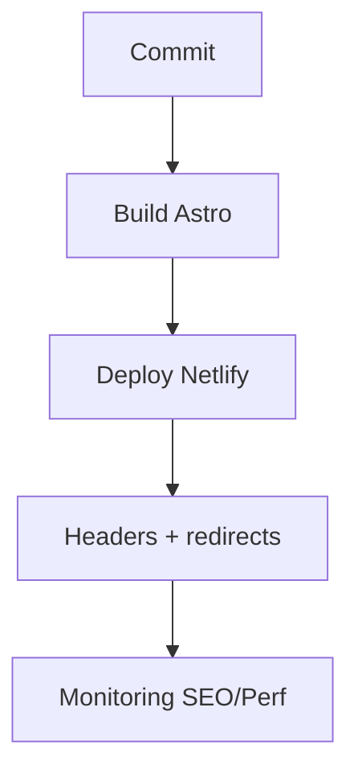

# Maintenance & monitoring (runbook)

Meta
Version : v1.0
Last updated : 2026-01-19
Perimetre : deploy, surveillance, audits, incidents, mises a jour.
Audience : ops / dev / SEO
Liens : ./1-architecture-technique-stack.md, ./4-seo-geo-ciblage-strategie.md, ./5-optimisation-images-performances.md, ./8-seo-technique-structured-data.md, ./9-workflows-checklists-operationnels.md

## Vue d'ensemble
Le site est statique. La maintenance consiste a verifier les builds, les redirects, les sitemaps, et la coherence SEO/headers. Netlify est la cible d'hebergement (configuration via `netlify.toml` et fichiers publics).

## Existant dans ce repo (as-is)
- Headers securite/perf: `netlify.toml`, `public/_headers`
- Redirects: `public/_redirects`, `_redirects`
- Sitemap: `src/pages/sitemap.xml.ts`, `public/sitemap.xml`
- Script generation sitemap: `src/scripts/generate-sitemap.ts` + `npm run generate-sitemap`

### Fichiers de reference
- `netlify.toml`
- `public/_headers`
- `public/_redirects`
- `_redirects`
- `src/pages/sitemap.xml.ts`
- `public/sitemap.xml`

## Comment ca marche
- Build statique via `astro build` -> sortie `dist/`.
- Netlify applique headers/redirects et sert les assets via CDN.
- Les audits SEO/perf sont a faire en dehors du repo (Lighthouse, GSC).

## Ou toucher dans le code
- Config deploy: `netlify.toml` (headers, redirects)
- Headers alternatifs: `public/_headers`
- Redirects alternatifs: `public/_redirects`, `_redirects`
- Sitemap: `src/pages/sitemap.xml.ts`, `public/sitemap.xml`

## Conventions & regles a respecter
- Eviter d'avoir 2 sources de verite concurrentes (headers/redirects/sitemap).
- Toute modification de slug doit ajouter un redirect.
- Maintenir la compatibilite CSP avec les scripts externes (GTM, Vimeo, ActiveCampaign).

## Antipatterns / pieges
- Modifier les headers dans `netlify.toml` sans synchroniser `public/_headers` (ou inverse).
- Garder un sitemap statique obsolete apres ajout de pages.
- Suppression de contenu sans redirect 301.

## Checklist de validation
- Build reussi et pages principales accessibles.
- Redirects critiques fonctionnels.
- Robots.txt reference le sitemap correct.
- CSP ne bloque pas les scripts externes.

## TODO / Recommandations
- Documenter la configuration Netlify effective (build command / publish dir) si elle est definie dans Netlify UI.
- Mettre en place un check automatique des liens brises (tool externe).
- Clarifier l'usage de `src/utils/middleware/security.ts` (present mais non reference).

## Routine d'entretien (suggestion)
| Cadence | Taches |
| --- | --- |
| Hebdo | Verifier pages clefs (offre, cours), redirects, erreurs 404 |
| Mensuel | Lighthouse perf/SEO, audit sitemap, robots |
| Trimestriel | MAJ dependances, revue CSP/headers |

## Voir aussi
- ./1-architecture-technique-stack.md
- ./4-seo-geo-ciblage-strategie.md
- ./5-optimisation-images-performances.md
- ./8-seo-technique-structured-data.md
- ./9-workflows-checklists-operationnels.md
