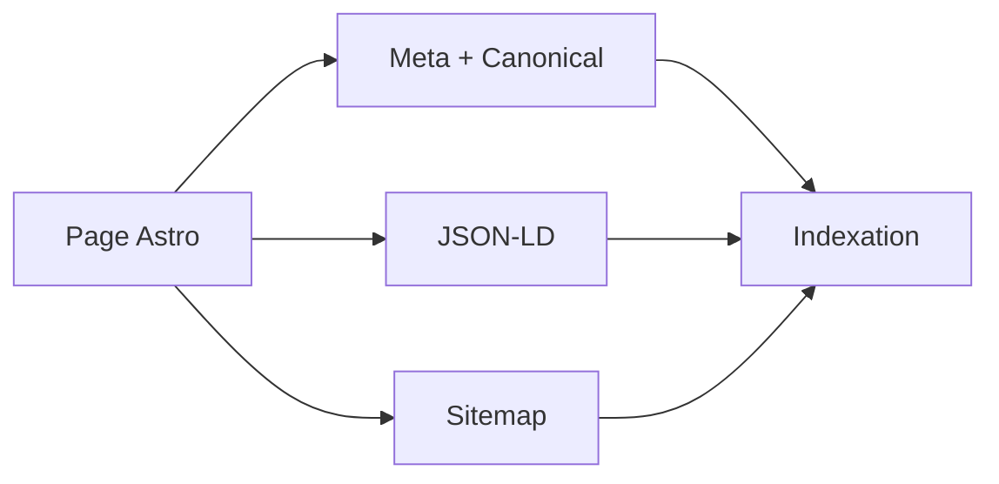

# SEO technique & structured data

Meta
Version : v1.0
Last updated : 2026-01-19
Perimetre : meta tags, JSON-LD, sitemap/robots, headers securite.
Audience : SEO / dev
Liens : ./1-architecture-technique-stack.md, ./4-seo-geo-ciblage-strategie.md, ./5-optimisation-images-performances.md, ./7-maintenance-monitoring-runbook.md, ./9-workflows-checklists-operationnels.md

## Vue d'ensemble
Le site utilise des schemas JSON-LD riches (Course, BlogPosting, FAQ, Product, Book, etc.) et des meta/canonical dans les layouts. Un sitemap dynamique et un robots.txt sont fournis. Les headers de securite sont declares dans Netlify et `_headers`.

## Existant dans ce repo (as-is)
### Meta / canonical
- Layout global: `src/layouts/Layout.astro`
- Layout article: `src/layouts/ArticleLayout.astro`
- Layout cours: `src/layouts/CourseLayout.astro`

### Sitemap & robots
- Robots: `public/robots.txt`
- Sitemap dynamique: `src/pages/sitemap.xml.ts`
- Sitemap statique: `public/sitemap.xml` (genere via script)

### Types de schema detectes
| Type schema | Emplacement | Exemple |
| --- | --- | --- |
| WebPage / Organization | `src/layouts/Layout.astro` | Pages standards |
| BlogPosting | `src/layouts/ArticleLayout.astro` | Articles blog |
| Course / Offer | `src/layouts/CourseLayout.astro`, `src/pages/cours/*.astro` | Pages cours |
| FAQPage | `src/components/FAQSchema.astro`, pages offre/cours | FAQ |
| BreadcrumbList | `src/components/Breadcrumbs*.astro` | Fil d'Ariane |
| VideoObject / HowTo | `src/layouts/ArticleLayout.astro` | Articles video/tutorial |
| Product / Offer | `src/pages/offre.astro`, `src/pages/pack-vacances-ukulele.astro` | Packs |
| Book | `src/pages/livres/*.astro` | Livres |
| ContactPage | `src/pages/contact.astro` | Contact |

### Fichiers de reference
- `src/layouts/Layout.astro`
- `src/layouts/ArticleLayout.astro`
- `src/layouts/CourseLayout.astro`
- `src/pages/sitemap.xml.ts`
- `public/robots.txt`
- `src/components/FAQSchema.astro`

## Comment ca marche
- Les layouts injectent meta tags, canonical et JSON-LD.
- Les pages specifiques ajoutent leur propre schema (cours, offre, ressources, livres).
- Le sitemap dynamique est genere via `getCollection` et expose `sitemap.xml`.

## Ou toucher dans le code
- Meta/OG/canonical: `src/layouts/*.astro`
- JSON-LD: `src/layouts/*.astro`, `src/pages/*.astro`, `src/components/FAQSchema.astro`
- Robots/sitemap: `public/robots.txt`, `src/pages/sitemap.xml.ts`
- Headers securite: `netlify.toml`, `public/_headers`, `src/utils/security.ts`

## Conventions & regles a respecter
- Garder des URLs canoniques absolues.
- Mettre a jour `dateModified` pour les contenus modifies.
- Eviter de dupliquer un schema incompatible (ex: FAQPage + FAQ markup incoherent).

## Antipatterns / pieges
- Oublier de mettre a jour le sitemap statique si utilise.
- Inserer des schema incomplete (ex: Product sans Offer).
- CSP trop stricte qui bloque GTM ou iframe (YouTube/Vimeo).

## Checklist de validation
- Rich Results Test: schemas valides.
- Lighthouse SEO: pas d'erreurs canonical/robots.
- Sitemap accessible et indexable.
- Robots.txt reference le bon sitemap.

## TODO / Recommandations
- Verifier si `public/sitemap.xml` doit rester ou etre supprime au profit de la route dynamique.
- Ajouter hreflang si geo-ciblage multi-langue est prevu.
- Aligner `src/utils/security.ts` avec la config de headers effective.

## Voir aussi
- ./1-architecture-technique-stack.md
- ./4-seo-geo-ciblage-strategie.md
- ./5-optimisation-images-performances.md
- ./7-maintenance-monitoring-runbook.md
- ./9-workflows-checklists-operationnels.md
