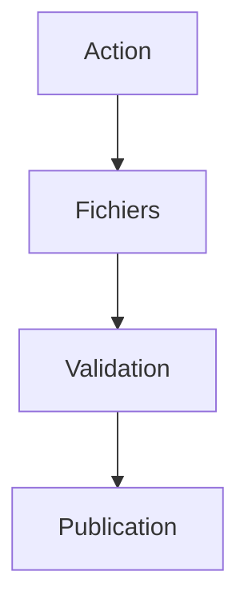

# Workflows & checklists operationnels

Meta
Version : v1.0
Last updated : 2026-01-19
Perimetre : procedures pas-a-pas et checklists par type d'action.
Audience : dev / content / SEO / ops
Liens : ./1-architecture-technique-stack.md, ./2-structure-projet-conventions.md, ./3-workflow-publication-automatisation.md, ./5-optimisation-images-performances.md, ./7-maintenance-monitoring-runbook.md

## Vue d'ensemble
Ce document centralise les workflows repetables (ajouter un contenu, corriger une 404, optimiser une image, verifier SEO/perf). Il reference les fichiers a modifier et les commandes de validation (lecture uniquement).

## Existant dans ce repo (as-is)
- Content pipelines via `src/content/*` et `getCollection()`.
- Redirects definis dans `public/_redirects` et `_redirects`.
- Sitemap dynamique et statique disponibles.

### Fichiers de reference
- `src/content/blog/`
- `src/content/courses/`
- `src/pages/`
- `public/_redirects`
- `src/pages/sitemap.xml.ts`

## Comment ca marche
Les workflows ci-dessous s'appuient sur des conventions de fichier et des scripts existants. Aucun script automatique d'ecriture n'est lance par defaut.

## Ou toucher dans le code
- Contenu: `src/content/**`
- Pages: `src/pages/**`
- Redirects: `public/_redirects` / `_redirects`
- Images: `public/images/**`
- SEO: `src/layouts/*.astro`, `src/pages/sitemap.xml.ts`, `public/robots.txt`

## Conventions & regles a respecter
- Toujours utiliser un slug stable (kebab-case) en nom de fichier.
- Mettre a jour `dateModified` pour chaque contenu modifie.
- Ajouter un redirect 301 si un slug change.

## Antipatterns / pieges
- Oublier de declarer un nouveau contenu dans la collection attendue.
- Modifier des headers dans un seul fichier quand deux sources existent.
- Publier une page de remerciement indexable.

## Checklists operationnelles
### Ajouter un article blog
1) Creer un fichier dans `src/content/blog/`.
2) Completer le frontmatter (title, description, ogImage, dates, prod).
3) Ajouter les images dans `public/images/...`.
4) Verifier que `prod` != `N` et date <= aujourd'hui.

### Ajouter une page cours/programme
1) Ajouter le Markdown dans `src/content/courses/` ou `src/content/programmes/`.
2) Verifier que la page route correspondante existe (`src/pages/cours/[slug].astro`).
3) Ajouter les images `public/images/cours/<slug>/`.

### Ajouter/optimiser une image
1) Copier l'image sous `public/images/...`.
2) Optionnel: lancer `npm run optimize-images`.
3) Verifier width/height (remark ou `OptimizedImage`).

### Corriger une 404
1) Ajouter un redirect 301 dans `public/_redirects`.
2) Verifier qu'il n'existe pas un doublon dans `_redirects`.

### Verifier SEO technique
1) Verifier `public/robots.txt`.
2) Verifier `src/pages/sitemap.xml.ts`.
3) Verifier canonical/OG sur les layouts.

### Verifier performances
1) Verifier images hero en eager.
2) Verifier headers cache dans `public/_headers`.
3) Verifier scripts externes en defer.

## Matrice tache -> fichiers -> commande
| Tache | Fichiers | Commande de verif |
| --- | --- | --- |
| Ajouter article | `src/content/blog/*` | `rg -n "datePublished" src/content/blog` |
| Ajouter cours | `src/content/courses/*` | `rg -n "ogImage" src/content/courses` |
| Redirect 301 | `public/_redirects` | `rg -n " 301" public/_redirects` |
| Sitemap | `src/pages/sitemap.xml.ts` | `rg -n "<url>" src/pages/sitemap.xml.ts` |
| Robots | `public/robots.txt` | `cat public/robots.txt` |

## Checklist de validation
- Slug stable et redirect en place si besoin.
- Meta/canonical/OG valides.
- Images optimisables et presentes dans `public/`.
- Sitemap et robots coherents.

## TODO / Recommandations
- Centraliser les redirects (eviter duplication `_redirects` vs `public/_redirects`).
- Ajouter une checklist de release Netlify (si build command est definie en UI).

## Voir aussi
- ./1-architecture-technique-stack.md
- ./2-structure-projet-conventions.md
- ./3-workflow-publication-automatisation.md
- ./5-optimisation-images-performances.md
- ./7-maintenance-monitoring-runbook.md
