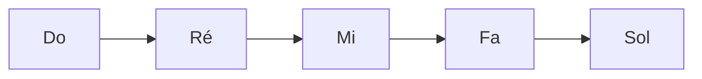

<!-- HTML -->
 <div class="modern-menu">
  <nav aria-label="Sommaire">
    <h3>Sommaire</h3>
    <ul>
      <li><a href="https://musique-facile.fr/blog/pourquoi-apprendre-le-piano" title="Pourquoi apprendre le piano ?">Pourquoi apprendre le piano ?</a></li>
      <li><a href="https://musique-facile.fr/blog/debuter-le-piano-bases-essentielles" title="Débuter le piano : Les bases essentielles">Débuter le piano</a></li>
      <li><a href="https://musique-facile.fr/blog/methodes-apprentissage-piano-debutant" title="Nos méthodes d’apprentissage pour débutants">Méthodes débutants</a></li>
      <li><a href="https://musique-facile.fr/blog/techniques-essentielles-piano" title="Techniques essentielles pour bien jouer">Techniques essentielles</a></li>
      <li><a href="https://musique-facile.fr/blog/erreurs-frequentes-piano-debutant" title="Les erreurs fréquentes des débutants">Erreurs fréquentes</a></li>
      <li><a href="https://musique-facile.fr/blog/plan-travail-progresser-piano" title="Plan de travail pour progresser rapidement">Plan de travail</a></li>
      <li><a href="https://musique-facile.fr/blog/ressources-apprendre-le-piano" title="Ressources supplémentaires pour aller plus loin">Ressources</a></li>
      <li><a href="https://musique-facile.fr/blog/faq-piano-debutant" title="FAQ – Réponses aux questions des débutants">FAQ</a></li>
      <li><a href="https://musique-facile.fr/blog/conclusion-apprentissage-piano" title="Conclusion et derniers conseils">Conclusion</a></li>
    </ul>
  </nav>
</div>

<!-- CSS -->
  <style>
       .modern-menu, .modern-menu * {
      margin: 0;
      padding: 0;
      box-sizing: border-box;
    }

    /* Conteneur principal du menu */
    .modern-menu nav {
      background-color: var(--theme-current-light);
      border: 1px solid var(--theme-current);
      padding: 10px;
      margin: 20px auto;
      max-width: 800px;
      border-radius: 8px; /* Bords arrondis */
      box-shadow: 0 2px 5px rgba(0, 0, 0, 0.1); /* Légère ombre */
      color: var(--theme-current-dark); /* Couleur du texte par défaut */
    }

    /* Titre du menu */
    .modern-menu h3 {
      font-size: 1.4em;
      margin-bottom: 5px;
      border-bottom: 1px solid var(--theme-current);
      padding-bottom: 5px;
      /* on peut aussi mettre la couleur du texte si besoin :
         color: var(--theme-current-dark);
      */
    }

    /* Liste en flex, espacée et sans puces */
    .modern-menu ul {
      list-style: none;
      display: flex;
      flex-wrap: wrap; /* Passe à la ligne si l'espace est insuffisant */
      gap: 15px;       /* Espace entre les liens */
    }

    /* On supprime tout symbole avant l'élément */
    .modern-menu li::before {
      content: none !important;
    }

    /* Style des liens */
    .modern-menu a {
      text-decoration: none;
      color: white;
      padding: 6px 10px;
      border-radius: 4px;
      transition: background-color 0.3s, color 0.3s;
    }

    /* Effet de survol */
    .modern-menu a:hover {
      background-color: var(--theme-current-light);
      color: var(--theme-current-dark);
    }

    /* Responsive : centrer le contenu sur mobile */
    @media (max-width: 600px) {
      .modern-menu ul {
        justify-content: center;
      }
    }
  </style>

## Images et Légendes

Vous pouvez insérer des images avec une légende explicative :


*Une guitare acoustique vintage dans son environnement naturel*

Les images peuvent aussi être alignées à gauche ou à droite du texte :


*Un magnifique piano de concert Steinway & Sons*

## Citations et Mises en Valeur

> La musique est la langue des émotions.
> — Emmanuel Kant

Vous pouvez aussi utiliser des citations en ligne avec la syntaxe `>` :

> Ce texte sera affiché comme une citation élégante avec un style distinct.

## Encadrés Spéciaux

<div class="info">
<h3>Information</h3>

Ceci est un encadré d'information qui met en valeur un contenu important. Les encadrés peuvent contenir plusieurs paragraphes et même des listes.

- Point important 1
- Point important 2
</div>

<div class="tip">
<h3>Astuce</h3>

Voici une astuce utile pour les lecteurs !
</div>

<div class="warning">
<h3>Attention</h3>

Attention à ce point particulier qui mérite une mise en garde.
</div>

## Sections avec Fond Coloré

<div class="section-colored" style="background-color: #f5f5f5;">
### Section Spéciale

Cette section utilise un fond coloré pour se démarquer du reste du contenu.
Elle peut contenir n'importe quel type de contenu Markdown.

- Liste
- D'éléments
- Importants
</div>

## Mise en Valeur du Texte

Vous pouvez utiliser différents styles de texte :

- ==Texte surligné== pour mettre en évidence
- **Texte en gras** pour l'importance
- *Texte en italique* pour l'emphase
- ~~Texte barré~~ pour les corrections
- `code inline` pour les termes techniques

## Blocs de Code

```javascript
// Exemple de code JavaScript avec coloration syntaxique
function jouerAccord(nom) {
  console.log(`Jouons l'accord ${nom}`);
  // Code pour jouer l'accord
}

jouerAccord('Do majeur');
```

## Emojis et Symboles

Les emojis peuvent être utilisés pour :
- 🎵 Représenter des notes de musique
- 🎸 Indiquer des instruments
- ⚡ Mettre en valeur des points importants
- 💡 Signaler des astuces
- ⚠️ Attirer l'attention

## Diagrammes et Schémas



## Raccourcis Clavier

Utilisez <kbd>Ctrl</kbd> + <kbd>C</kbd> pour copier et <kbd>Ctrl</kbd> + <kbd>V</kbd> pour coller.

## Abréviations

Le HTML est un langage de balisage.
*[HTML]: HyperText Markup Language

## Notes de Bas de Page

Voici un texte avec une note de bas de page[^1].

[^1]: Ceci est le contenu de la note de bas de page.
